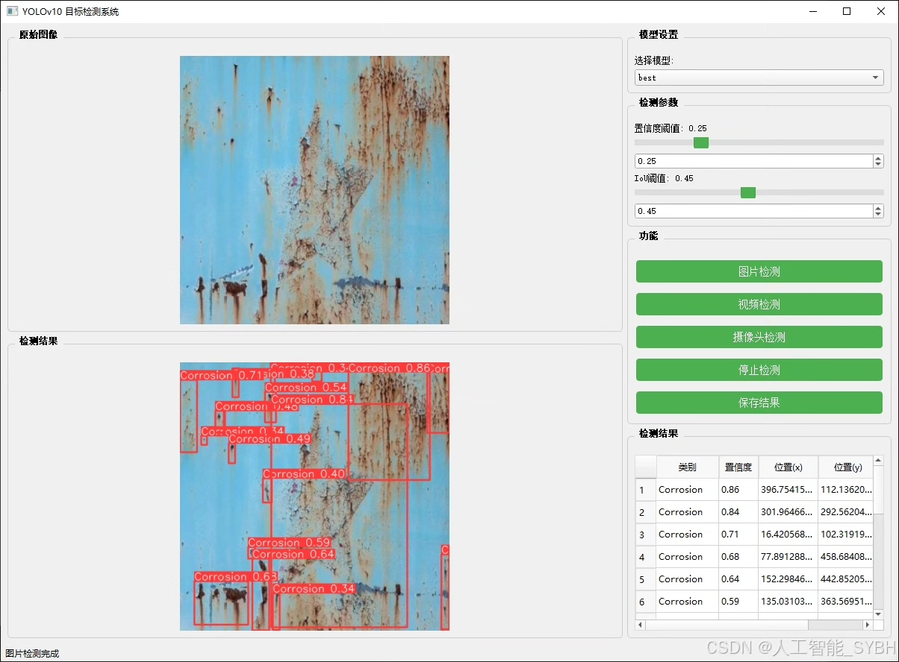
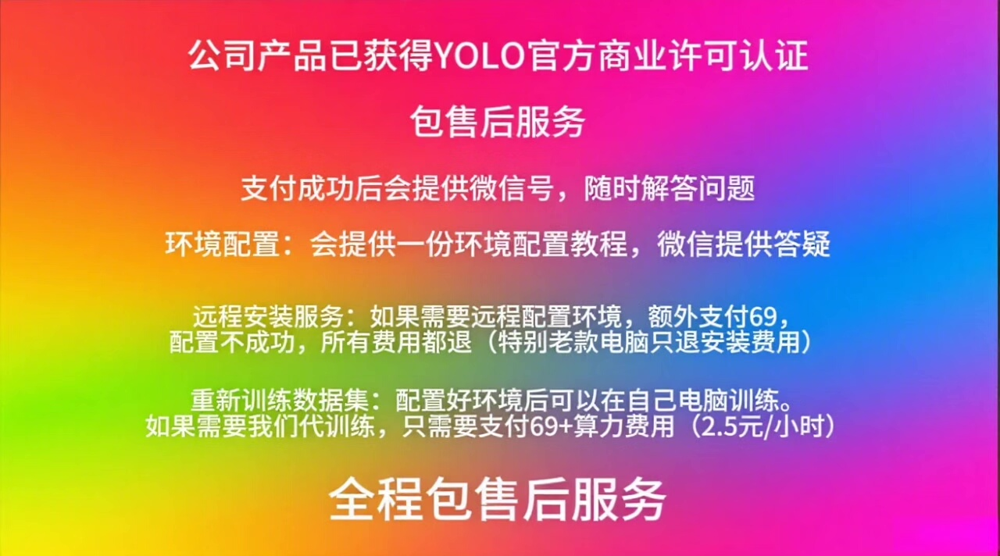
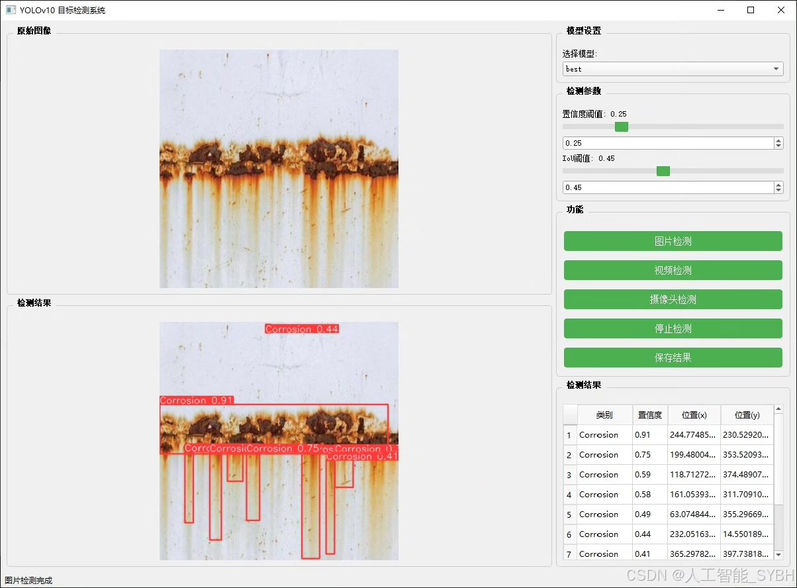
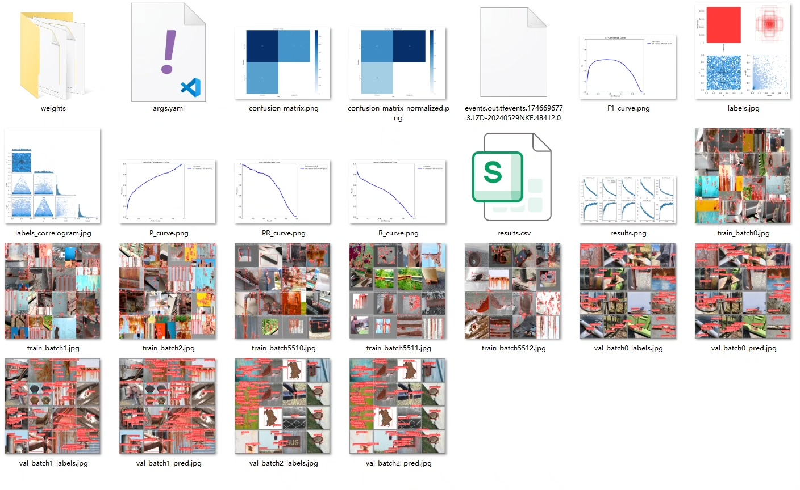
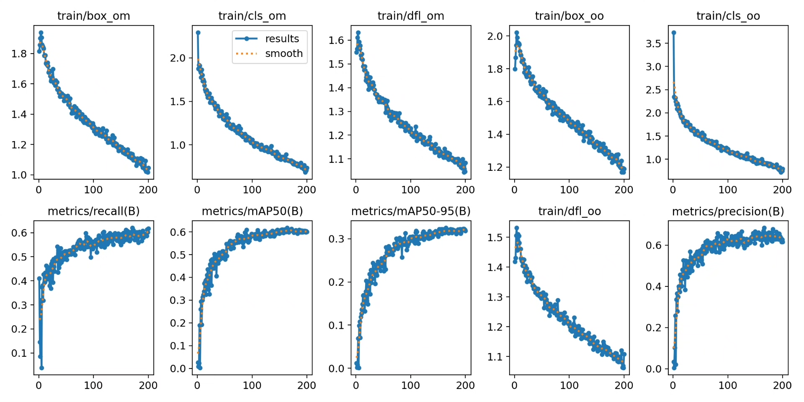
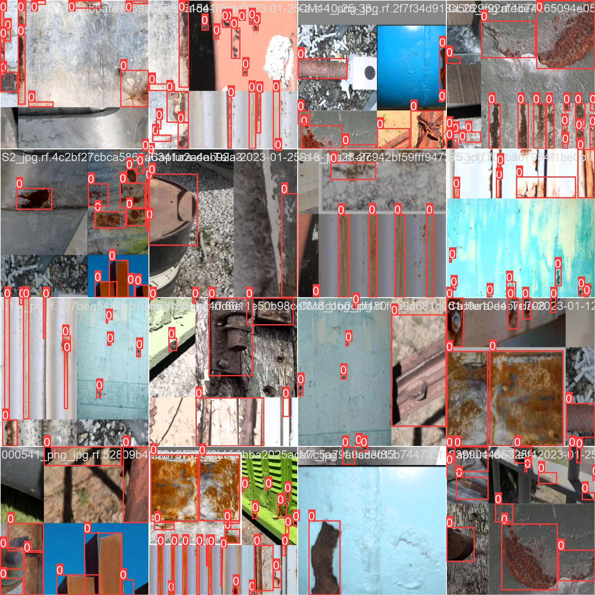
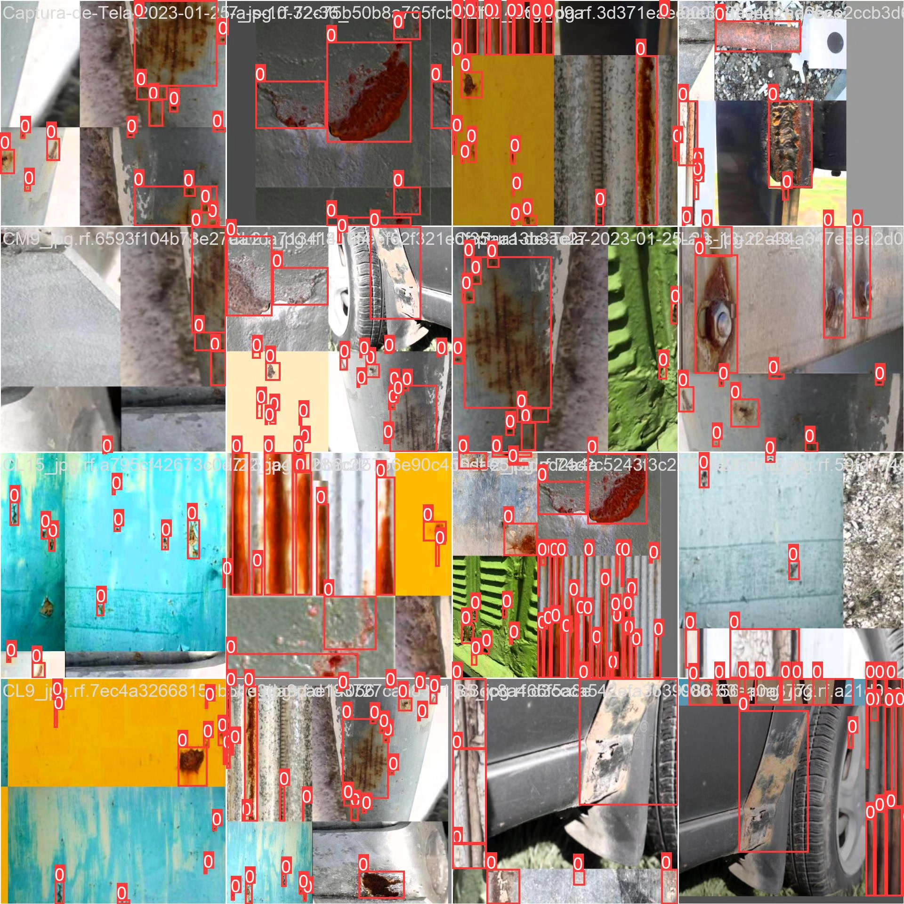
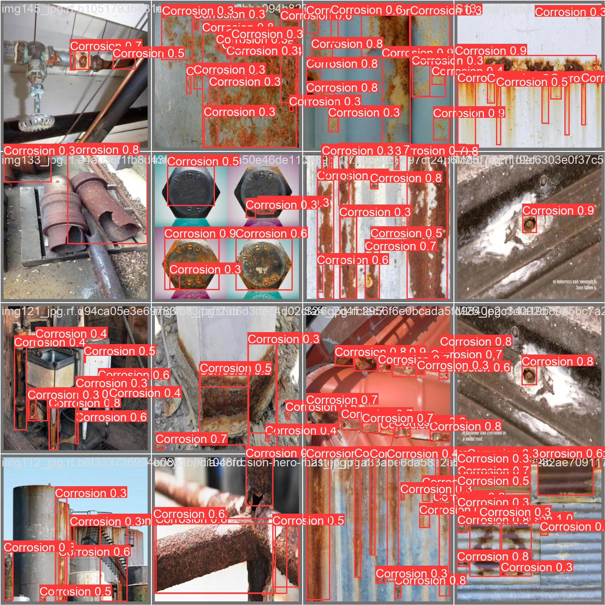
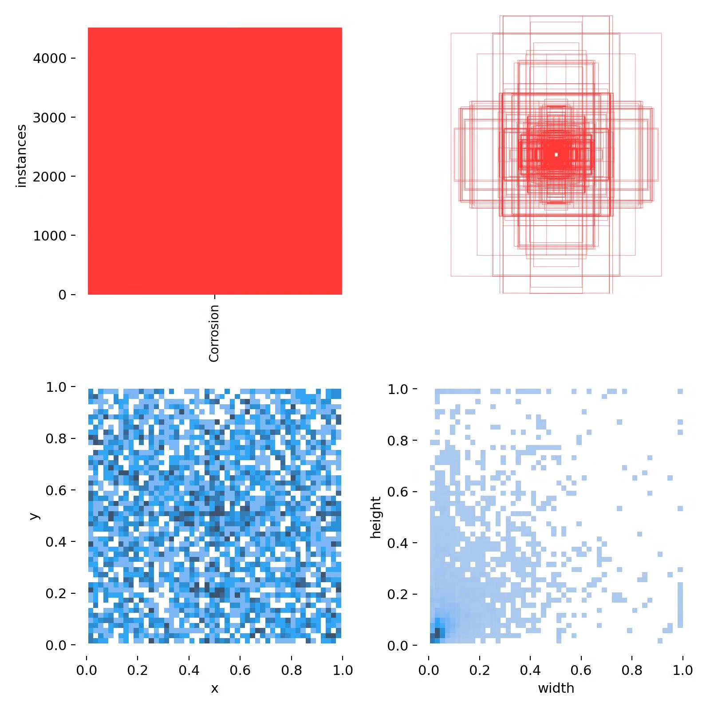

# Based on deep learning YOLOv10 for steel corrosion rust detection system (YOLOv

## Body

Based on the YOLOv10 object detection algorithm, this project has developed a high-precision intelligent rust detection system for steel corrosion. It focuses on identifying the corrosion areas (Corrosion) on metal surfaces. The system is trained and optimized on datasets, capable of automatically detecting the corrosion situation of steel structures such as bridges, pipelines, ships, and building steel structures, providing an intelligent solution for industrial inspection, infrastructure maintenance, and preventive maintenance.

The company's products have obtained the official commercial license certification from YOLO.

We provide after-sales service.

After payment, we will provide a WeChat account to answer questions anytime.

Environmental configuration: We will provide a tutorial on environmental configuration, and WeChat will provide答疑.

Remote installation service: If you need remote configuration, an additional fee of 69 is required.
If the configuration fails, all fees will be refunded (specially for old computers only refund installation fees).

Retraining dataset: After configuring the environment, you can train on your own computer.
If you need us to retrain, just pay 69 + computing power fees (2.5 yuan/hour).

Full after-sales service

## Images

## Payment

Here is a pay link on Stripe ( https://buy.stripe.com/3cs8yP7sY87d0vu9AB ). Please contact me lonlonago@foxmail.com after funding $89, and I will send you a complete data files , thank you!

